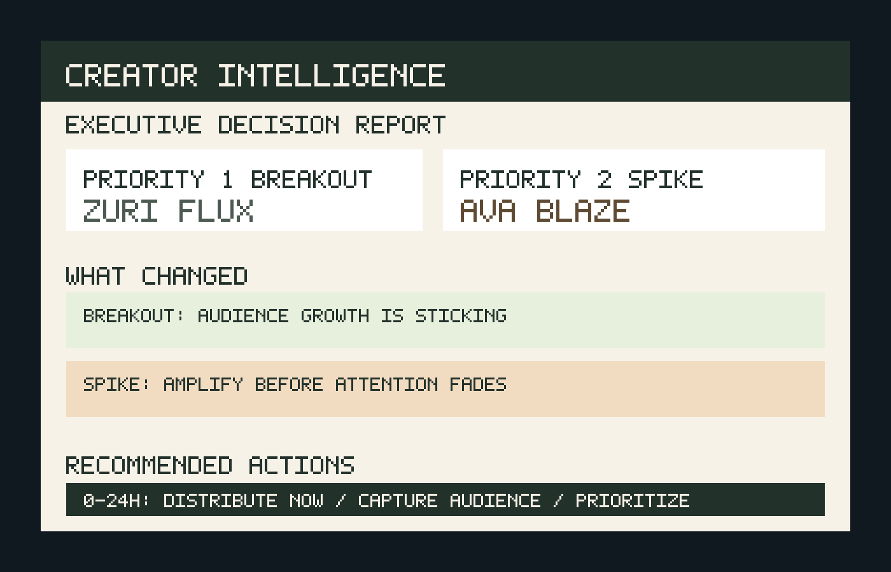

# Creator Intelligence Layer — Decision Support System for Creator & Stream Analytics

## What this is
This is not a dashboard.

This is a decision-support system that identifies where attention is compounding and tells teams what to do about it in real time.

It simulates an internal analytics layer for a creator-media or live-streaming company: ingest fragmented data, normalize it, detect breakout vs spike signals, and generate execution priorities for content, growth, and partnerships teams.

## Example Output
Below is a real example of the system output.



Full report available in `outputs/sample_report.md`.

## Project Snapshot
- `Problem`: creator teams rely on fragmented analytics and still need to manually decide what matters
- `Solution`: a backend decision layer that turns multi-source metrics into prioritized action
- `Output`: an executive Markdown report with creator phases, business meaning, and recommended next steps
- `Audience`: content strategy, creator operations, growth, and partnerships teams

## Why I Built This
Most analytics projects show data. Real internal tools help people make decisions.

I built this project to demonstrate the backend logic behind a decision-intelligence system:
- ingestion across multiple simulated sources
- normalized creator-hour analytics
- KPI generation
- signal detection
- executive reporting that translates data into action

The goal was not to build a UI. The goal was to build the system that makes a useful UI, report, or internal workflow possible.

## What This System Does
- Ingests simulated creator growth, stream performance, and social listening feeds
- Normalizes fragmented source data into one creator-hour model
- Computes decision-facing KPIs like `creator_performance_score`, `stream_impact_score`, and `trend_momentum_index`
- Detects operating signals like engagement spikes, abnormal growth, conversation surges, and emerging creators
- Classifies creator situations as `breakout`, `spike`, or `stable`
- Generates an executive decision report with prioritized actions

## Why This Matters
In real companies, analytics fragmentation slows teams down.

Dashboards show what happened. This system explains what matters and what to do next.

That difference matters because creator windows are time-sensitive. A breakout creator needs investment before the market catches up. A spike creator needs fast distribution before attention fades.

## Demo Outputs
When the pipeline runs, it generates:
- raw demo feeds in `data/raw/`
- processed analytics tables in `data/processed/`
- an executive decision report in `outputs/creator_report.md`
- a stable sample report in `outputs/sample_report.md`

## Full Sample Report

```md
# Creator Intelligence Executive Decision Report

## Executive Summary
- Zuri Flux is the most important creator to act on right now. They have moved beyond routine growth and into a breakout moment that can be scaled.
- This matters because Zuri Flux combines momentum (53.61) with material stream impact (91.42), creating a timely opportunity to increase reach, sponsor visibility, and audience capture while attention is still building.
- Ava Blaze is the secondary priority: the signal is less about scale today and more about acting before the current window closes.

## What Changed (Last 12 Hours)
- Ava Blaze: engagement has broken above normal range, creating a narrow amplification window where extra distribution can turn creator momentum into broader reach.
- Zuri Flux: viewer energy is building on top of an already strong base, which points to a rising creator rather than a one-off traffic bump.
- Zuri Flux: audience growth is converting unusually well, which means current attention is sticking and increasing the creator's long-term value.
- Ava Blaze: public conversation is surging around the creator, raising the odds that well-timed clips or reposts will travel beyond the existing audience.
- Zuri Flux: market attention is widening, which lowers distribution risk and improves the case for giving this creator more surface area.

## Why It Matters
- Zuri Flux is in a breakout phase. This is the point where the business can gain disproportionate upside by investing before pricing, sponsorship demand, and internal competition rise.
- Ava Blaze is in a spike phase. The opportunity is immediate, but so is the risk of waiting: if action slips, the company captures the noise but not the value.
- Noah Vector is in a stable phase. This is a lower-urgency asset that supports predictable packaging, steadier ROI, and cleaner planning decisions.

## Recommended Actions
### Immediate (0-24h)
- Priority 1 Breakout: Zuri Flux -> Expand distribution for Zuri Flux immediately across owned channels and clip surfaces while the current demand window is still open.
- Priority 2 Spike: Ava Blaze -> Expand distribution for Ava Blaze immediately across owned channels and clip surfaces while the current demand window is still open.
- Priority 1 Breakout: Zuri Flux -> Flag Zuri Flux for audience capture now by tightening follow prompts, end cards, or cross-promotion while conversion is running above normal.

### Short-term (1-3 days)
- Priority 1 Breakout: Zuri Flux -> Build a follow-on content package around Zuri Flux over the next 1-3 days so the current surge becomes a sustained viewing cycle.
- Priority 2 Spike: Ava Blaze -> Build a follow-on content package around Ava Blaze over the next 1-3 days so the current surge becomes a sustained viewing cycle.
- Priority 1 Breakout: Zuri Flux -> Review Zuri Flux's recent programming mix and repeat the elements that are clearly turning attention into audience retention.

### Strategic (Longer-term)
- Priority 1 Breakout: Zuri Flux -> Add Zuri Flux to the rapid-response priority list so future spikes trigger distribution, sales, and programming decisions without delay.
- Priority 2 Spike: Ava Blaze -> Add Ava Blaze to the rapid-response priority list so future spikes trigger distribution, sales, and programming decisions without delay.
```

## System Architecture
- `Ingestion`: simulates upstream creator growth, stream telemetry, and social listening systems
- `Normalization`: creates one clean creator-hour model from fragmented inputs
- `Metrics Layer`: calculates performance, impact, and momentum KPIs
- `Signal Detection`: identifies meaningful operating signals instead of raw movement
- `Reporting Layer`: converts signal combinations into an executive decision brief

## Repository Engine
The repository is built around a simple operating flow:

```text
raw inputs -> normalized metrics -> KPI layer -> signal layer -> executive decisions
```

That separation keeps the project readable while reflecting how a real internal analytics system would separate concerns.

## What Makes This Interesting
- It is framed like an internal business system, not a tutorial
- It prioritizes action and timing over charts
- It shows data engineering, analytics design, and product judgment in one repo
- It can evolve into real connectors, orchestration, storage, and delivery surfaces

## Engineering Decisions
- `Simple modules over frameworks`: easier to inspect, run, and extend
- `File-based pipeline`: keeps the demo portable while preserving realistic data boundaries
- `Simulated raw sources`: makes the repo self-contained and always runnable
- `Separate KPIs and signals`: keeps metric calculation independent from decision logic
- `Markdown reporting`: makes the system useful without needing a frontend

## Current Status
- `Strong today`: runnable end-to-end pipeline, realistic demo data, normalized metrics, KPI tables, signal detection, and executive report generation
- `Still true`: this is a prototype, not a deployed production service
- `Improving next`: real connectors, stronger anomaly scoring, scheduled runs, historical snapshots, and delivery through API or internal tooling

## Roadmap
- `Data ingestion`: replace simulated JSON feeds with connector-style ingestion from APIs, warehouses, or event streams
- `Storage`: move processed outputs into a database, object store, or lakehouse table
- `Scheduling`: run the pipeline on a cadence with Airflow, Dagster, Prefect, or cron
- `Signal quality`: add confidence scoring, historical baselines, and configurable thresholds
- `Reporting`: generate historical report snapshots and compare week-over-week creator movement
- `Delivery`: expose the decision layer through an internal API, Slack brief, or lightweight web surface
- `Governance`: add data contracts, validation checks, and run metadata for production reliability

## Repository Structure

```text
creator_intelligence_layer/
├── assets/
│   └── sample.png
├── data/
│   ├── processed/
│   │   ├── creator_kpis.csv
│   │   ├── detected_signals.csv
│   │   ├── latest_snapshot.csv
│   │   └── unified_metrics.csv
│   └── raw/
│       ├── creator_metrics.json
│       ├── social_listening.json
│       └── stream_metrics.json
├── ingestion/
│   └── simulate_sources.py
├── outputs/
│   ├── creator_report.md
│   └── sample_report.md
├── processing/
│   ├── kpis.py
│   └── normalize.py
├── reporting/
│   └── generate_report.py
├── signals/
│   └── trend_detection.py
├── tests/
│   └── test_pipeline.py
├── main.py
├── README.md
└── requirements.txt
```

## Setup

```bash
pip install -r requirements.txt
```

## Run

```bash
python main.py
```

Expected console output:

```text
[creator-intelligence] ingestion    Generating simulated source feeds
[creator-intelligence] processing   Loading raw sources
[creator-intelligence] processing   Normalizing creator, stream, and social data
[creator-intelligence] kpis         Calculating performance, impact, and momentum scores
[creator-intelligence] signals      Detecting spikes, growth shifts, and breakout creators
[creator-intelligence] reporting    Generating executive decision report
[creator-intelligence] complete     Report written to .../outputs/creator_report.md
```

## Test

```bash
python -m unittest discover -s tests
```

## Outputs
- Executive report: `outputs/creator_report.md`
- Sample report snapshot: `outputs/sample_report.md`
- Processed tables: `data/processed/`
- Raw source payloads: `data/raw/`

## Design Philosophy
Most analytics systems stop at dashboards.

They show data, but they do not tell teams what to do.

This system focuses on:
- detecting meaningful signals, not just metrics
- classifying opportunity types, especially breakout vs spike
- translating analytics into execution priorities

The value is not visual complexity. The value is operational clarity.
